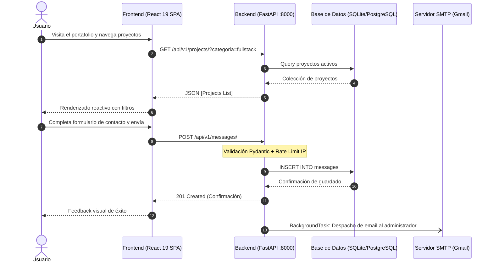

# 🌟 Portafolio Profesional V2 — Full Stack Developer & Data / AI

Plataforma web profesional desacoplada para presentación de perfil de ingeniería, proyectos de software, acreditaciones técnicas y canal directo de contacto. Diseñada bajo una arquitectura cliente-servidor moderna con frontend en **React 19 / Vite** y backend API en **FastAPI (Python)**.

---

## 🏛️ Arquitectura General del Sistema

El proyecto está estructurado como un monorepo desacoplado que separa claramente las responsabilidades del cliente y del servidor:

```text
2. Portafolio V2/
├── backend/                  # API RESTful con FastAPI, SQLAlchemy y JWT
│   ├── app/                  # Núcleo de la aplicación Python
│   ├── main.py               # Servidor ASGI y configuración de endpoints
│   ├── requirements.txt      # Dependencias Python
│   └── README.md             # Documentación técnica específica del backend
│
├── frontend/                 # Aplicación SPA cliente con React 19 y Vite
│   ├── src/                  # Componentes, vistas, contextos y tokens de diseño
│   ├── package.json          # Dependencias y scripts de Node.js
│   ├── vite.config.js        # Configuración del bundler
│   └── README.md             # Documentación técnica específica del frontend
│
├── OLDS/                     # Archivos y versiones históricas de referencia
├── plan_backend_fastapi.md   # Especificación de diseño y arquitectura de la API
├── TECHNICAL_GUIDE.md        # Guía técnica de desarrollo y patrones
├── TECHNICAL_REFERENCE.md    # Referencia de integración y diseño
└── README.md                 # Este documento
```

---

## 🚀 Flujo de Integración Cliente - Servidor



---

## 💻 Requisitos Previos

- **Node.js**: v18.0 o superior (con `npm` o `pnpm`)
- **Python**: v3.10 o superior (con `pip`)
- **Git**

---

## ⚡ Guía Rápida de Instalación y Ejecución

### 1. Iniciar el Backend (FastAPI)

Abre una terminal en la raíz del proyecto:

```bash
cd backend

# Crear y activar entorno virtual
python -m venv venv
# En Windows PowerShell:
.\venv\Scripts\Activate.ps1
# En Linux/macOS:
source venv/bin/activate

# Instalar dependencias
pip install -r requirements.txt

# Configurar variables de entorno
copy .env.example .env

# Iniciar servidor con recarga en caliente
uvicorn main:app --reload --port 8000
```

- Documentación interactiva de la API: [http://localhost:8000/docs](http://localhost:8000/docs)
- Health check: [http://localhost:8000/api/v1/health](http://localhost:8000/api/v1/health)

### 2. Iniciar el Frontend (React + Vite)

En una segunda terminal, dirígete al directorio frontend:

```bash
cd frontend

# Instalar dependencias
npm install

# Iniciar entorno de desarrollo
npm run dev
```

- Aplicación web: [http://localhost:5173](http://localhost:5173)

---

## 📚 Documentación Detallada por Componente

Para conocer la configuración avanzada, catálogo de endpoints, schemas de validación y guías de estilos:

- 📖 **[Backend README](file:///c:/PROYECTOS/FRONTEND/2.%20Portafolio%20V2/backend/README.md)**: Modelos SQLAlchemy, flujos de seguridad JWT/OAuth2, seed de base de datos, colección de Postman y variables de configuración.
- 🎨 **[Frontend README](file:///c:/PROYECTOS/FRONTEND/2.%20Portafolio%20V2/frontend/README.md)**: Arquitectura de componentes, tema claro/oscuro (ThemeContext), sistema de tokens CSS y consumo de la API REST.

---

## 🛡️ Seguridad y Buenas Prácticas

1. **Gestión de Secretos**: Los archivos `.env` reales nunca deben versionarse en el repositorio. Se proveen archivos `.env.example` como plantilla.
2. **CORS Configurado**: El backend únicamente acepta peticiones de los orígenes explícitamente declarados en `CORS_ORIGINS`.
3. **Manejo de Errores Limpio**: Excepciones no controladas retornan un payload uniforme `{"detail": "..."}` sin filtrar datos sensibles del sistema en producción.
4. **Protección contra Spam**: Rate limiting automático en endpoints públicos y validación estricta de esquemas de datos entrantes.
